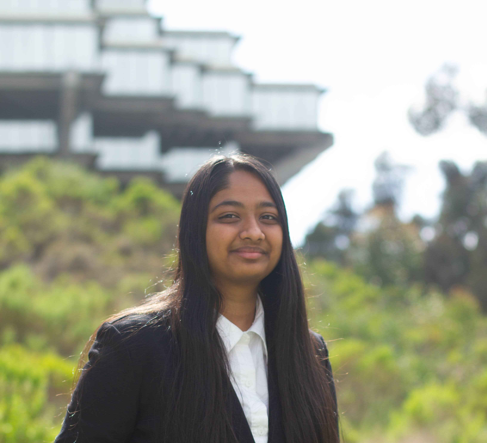

# Khushi Patel

Welcome to my page! My name is **Khushi**, and I'm a second year studying **Computer Science @ UC San Diego**.


## Sections:
[My LinkedIn and GitHub](#my-linkedin-and-github)

[Interests](#interests)

[Some Favorite Quotes](#some-favorite-quotes)

[Other Things About Me](#other-things-about-me)

[Academic Tasks for this week](#academic-tasks-for-this-week)

## **My LinkedIn and GitHub**
[My LinkedIn](https://www.linkedin.com/in/pateljkhushi)

[My GitHub](https://github.com/khushijpatel)

## **Hello in Python vs Java vs C++**
Python:
```
print("Hello World!")
```

Java:
```
public class HelloWorld {
    public static void main(String[] args) {
        System.out.println("Hello, World");
    }
}
```

C++:
```
#include <iostream>
using namespace std;

int main() {
    cout << "Hello World!";
    return 0;
}
```

## **Interests**

Below are my technical and non-technical interests!

### **Technical**
1. Software Engineering Processes
2. Full-stack Development
3. Containers and orchestration software
4. Computer Vision applications

### **Non-technical**

1. Cooking
2. Hanging out with friends & family
3. Watching TV shows and movies


## **Some Favorite Quotes**
In no particular order since it's too hard to rank them:
- > *"Mistakes are proof that you're trying" - Anonymous*
- > *"It does not matter how slowly you go as long as you do not stop." -Confucius*
- > *"The most effective way to do it, is to do it." -Amelia Earhart*
- > *"Intelligence is the ability to adapt to change." -Stephen Hawking*


:max_bytes(150000):strip_icc()/3-d27f10d51465414eb3165f37087629e6.png)

---

## **Other Things About Me**

I'm currently a technical event director for ACM @ UCSD - [check out our website here!](https://acmucsd.com)
I'm also conduction research as part of Early Research Scholars Program(ERSP) here at UCSD.

## **Academic Tasks for this week**
- [x] Read syllabus for all classes
- [x] Set up calendar for quarter
- [x] Finish Lab 1 for CSE 110
- [ ] Finish weekly assignments for EDS124AR
- [ ] Read chapter for CSE 105
- [ ] Set up environment for CSE 130
- [x] Make progress on research project